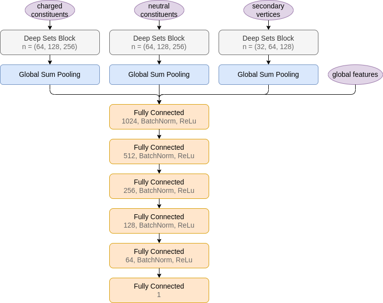
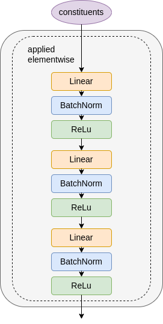
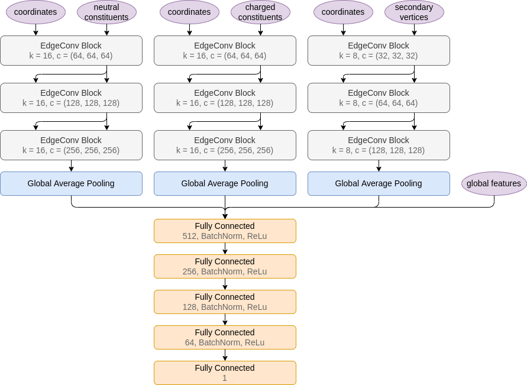
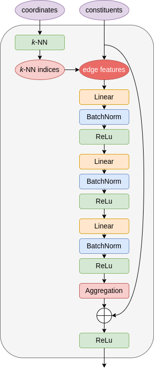

# jec-dnn

Jet Energy Corrections with Graph Neural Network Regression

## Models

The jet data is made up of variable-length unordered sets. To deal with this I use [Deep Sets](http://arxiv.org/abs/1703.06114) since the method has been used successfully before in [Energy Flow Networks](http://arxiv.org/abs/1810.05165) to discriminate quark jets from gluon jets.

In addition to that I experiment with [ParticleNet](https://arxiv.org/abs/1902.08570) which is based on [Dynamic Graph Convolutional Neural Network](https://arxiv.org/abs/1801.07829). This architecture is also suitable for variable length sets.

ParticleNet | EdgeConv block
--- | --- 
 | 

Particle Flow Network | Deep Sets block
--- | --- 
 | 

## Environment

Build the Docker image: dependencies in `requirements.txt` on top of `tensorflow/tensorflow:latest-gpu`).

```bash
docker build . -t jec-dnn
```

Enter a container with the current directory mounted using your user privileges.

```bash
./run_docker.sh
```

Re-enter stopped container

```bash
docker start -i <container id>
```

### Training

To train once you can edit `config.yaml` to your liking and then run something like:

```
python train.py -i data/shards -o models/particlenet -c config.yaml --gpus 0 1
```

Train using multiple configuration files:

```
nohup ./run_configs.sh -d data/shards -o results/resnet -c configs/resnet -g 0 > resnet.txt
```

### Plot results

Plot the training results

```
python plot.py -i "models/pfn, models/particlenet, models/pfn-lite, models/particlenet-lite" -n "PFN-r, ParticleNet-r, PFN-r Lite, ParticleNet-r Lite" -o figures/results
```

Produce visualizations of the dataset

```
python visualize_data.py -i data/shards -o figures/dataset
```

### Use models

To load trained model weights and make predictions, run e.g.

```
python predict.py --model_dir models/particlenet --data_dir data/shards --pred_dir .
```

For this to work, root files with the same feature names as in the config files in the saved model directories are needed. The script will then produce a pickle file with predictions as an array in the specified output directory.

### Cite

```
@mastersthesis{jec_with_gnn_regression,
  title  = {Jet Energy Corrections with Graph Neural Network Regression},
  author = {Holmberg, Daniel},
  school = {University of Helsinki},
  year   = {2022}
}
```