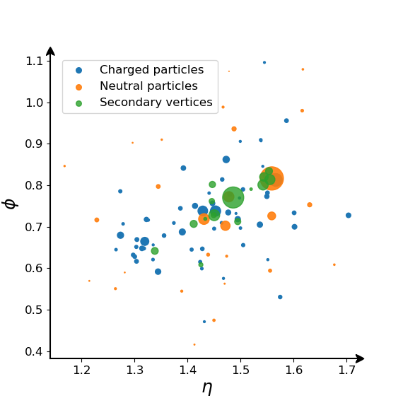
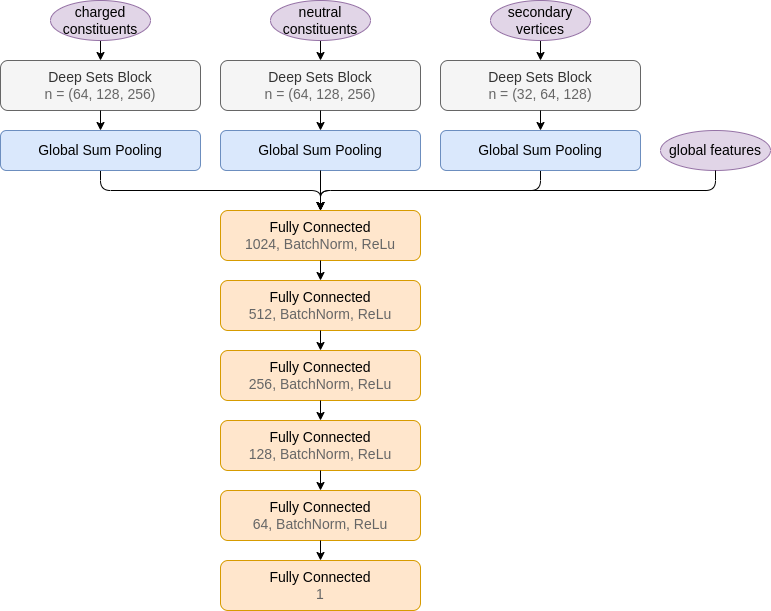
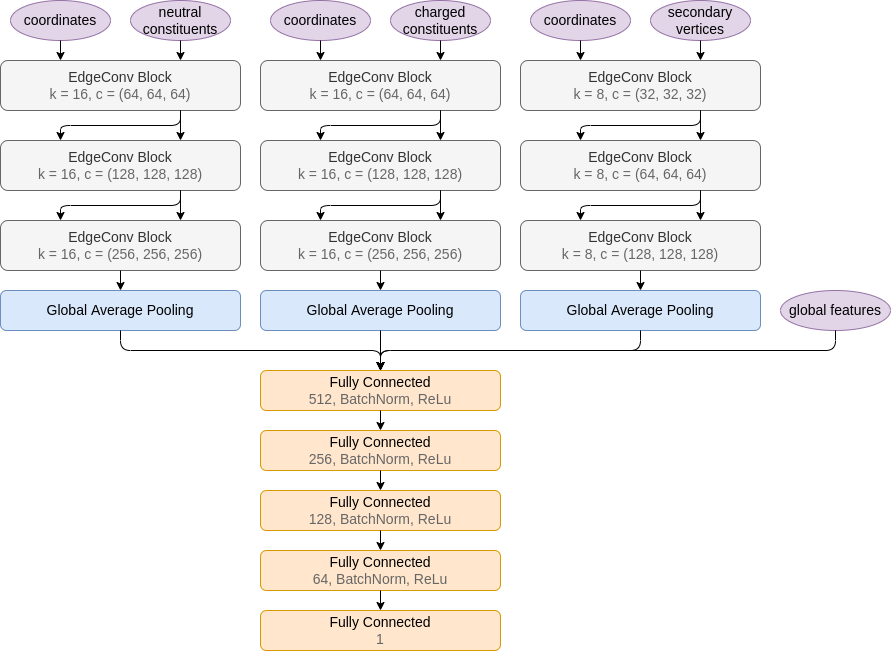
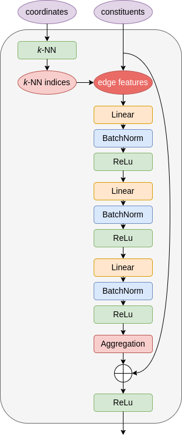

# jec-gnn

Jet Energy Corrections with Graph Neural Network Regression

## Data

The data used in this study consists of 14 million jets, of which 60% are used for training, 20% for validation and 20% for testing. The data is stitched together from multiple LHC Run 2 Summer 16 $H_T$-binned QCD samples. The [ml-jec-vars](https://gitlab.cern.ch/dholmber/ml-jec-vars) code, which is created for especially ML JEC, was used to produce the training data.

The data consists of global jet features, in addition to jet constituents forming unordered sets. There are three collections of constituents: charged particles, neutral particles and secondary vertices. The image below shows the constituents of a single jet in the ($\eta, \phi$)-plane. Data in this format is known as a point cloud in machine learning terms, or a particle cloud in high energy physics lingua.



## Models

[Deep Sets](http://arxiv.org/abs/1703.06114) apply a shared MLP to every set member, and then use permutation invariant aggregation to learn global features. This type of model has been used successfully before in [Energy Flow Networks](http://arxiv.org/abs/1810.05165) which introduced Particle Flow Network among other variants to discriminate quark jets from gluon jets.

[Dynamic Graph Convolutional Neural Network](https://arxiv.org/abs/1801.07829) initializes a graph (e.g. in 3D space) and uses k-NN to build a local neighborhood for every node. Graph convolution updates node embeddings, and the new latent features are used to construct an updated graph for the next convolution block. Global pooling is used to aggregate individual node level features to graph level. While the architecure is originally intended for point clouds in computer vision, it has been applied as [ParticleNet](https://arxiv.org/abs/1902.08570) to particle clouds.

Particle Flow Network | Deep Sets block
--- | --- 
 | 

ParticleNet | EdgeConv block
--- | --- 
 | 

## Environment

Build the Docker image
- base `tensorflow/tensorflow:2.4.1-gpu`
- install additional dependencies from `requirements.txt`
- make executables accessible by adding `bin` to path

```bash
docker build . -t jec-gnn
```

Start a container
- interactively
- with current directory mounted
- using your own user id
- gpus accessible inside container

```bash
./run_docker.sh
```

Re-enter stopped container

```bash
docker start -i <container id>
```

## Train

Train once
- specify training setup in a yaml file
- example configuration in `config.yaml`

```
train.py -i data/shards -o models/particlenet -c config.yaml --gpus 0 1
```

Train multiple variations
- run all configuration files in a single folder

```
nohup ./run_configs.sh -d data/shards -o results/resnet -c configs/resnet -g 0 > resnet.txt
```

## Figures

Plot results
- response distribution
- flavor dependence
- resolution
- residual response
- pdf and png in separate folders

```
plot.py -i "models/pfn, models/particlenet, models/pfn-lite, models/particlenet-lite" -n "PFN-r, ParticleNet-r, PFN-r Lite, ParticleNet-r Lite" -o figures/results
```

Visualize data
- heatmap of dataset in pt and eta bins
- flavor distribution
- particle cloud
- training target
- multiplicity
- jet ellipse minor axis
- pt distribution variable

```
visualize_data.py -i data/shards -o figures/dataset
```

## Predict

Inference with saved models
- load saved model weights
- make predictions for input data
- store correction factor as pickled array
- output total inference time

```
predict.py --model_dir models/particlenet --data_dir data/shards --pred_dir .
```

## Standard benchmark

Run inference for standard approach
- use coffea jetmet tools
- build jec stack consisting of l1 and l2 corrections
- run on a QCD Flat NanoAOD file
- prerequisite: produced data using https://github.com/deinal/PFNano

```
standard_benchmark.py --nanoaod data/nano/nano106Xv8_on_mini106X_2017_mc_NANO_py_NANO_10.root --l1 data/nano/Summer19UL18_V5_MC_L1FastJet_AK4PFchs.txt --l2 data/nano/Summer19UL18_V5_MC_L2Relative_AK4PFchs.txt
```

## Cite

```
@mastersthesis{jec_with_gnn_regression,
  title  = {Jet Energy Corrections with Graph Neural Network Regression},
  author = {Holmberg, Daniel},
  school = {University of Helsinki},
  year   = {2022}
}
```